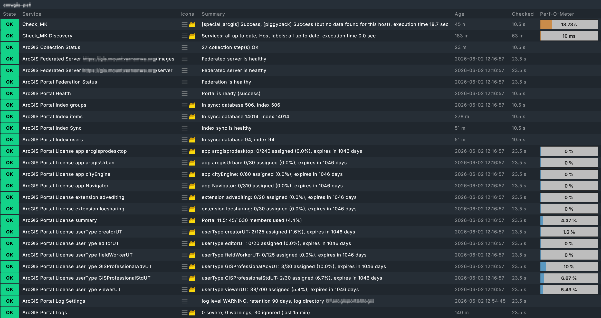
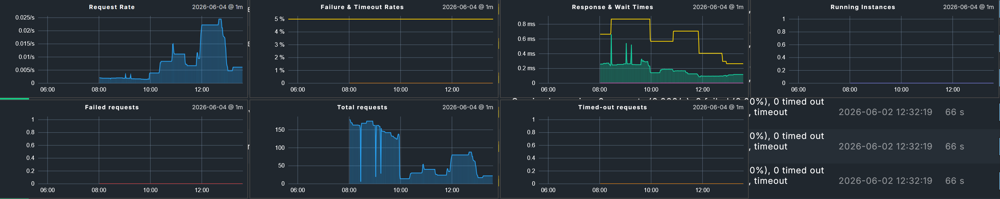

# Checkmk ArcGIS Enterprise Plugin

[](LICENSE)
[](https://checkmk.com/)
[](https://enterprise.arcgis.com/)

A Checkmk special agent for monitoring ArcGIS Enterprise through the ArcGIS REST Admin API.

The plugin runs from a Checkmk host representing ArcGIS Portal, collects Portal-level health and configuration, discovers federated ArcGIS Server sites, and emits Server data as Checkmk piggyback sections.

## Features

- Portal health, index status, federation validation, license usage, log settings, and Portal logs
- Federated ArcGIS Server monitoring through Checkmk piggyback data
- Server machine state, service state, service usage statistics, logs, site mode, web adaptors, datastores, and licenses
- Graphs for service request rate, failures, timeouts, response time, wait time, running instances, licenses, index counts, and log counts
- Configurable service and machine state handling
- Configurable thresholds for service failures, timeouts, response time, licenses, logs, datastores, federation, and collection status
- Optional collection scope controls and per-section cache intervals
- Federated server include and exclude regex filtering
- Portal and Server log suppression filters for known noisy log messages

## Screenshots

### ArcGIS Portal Services


### ArcGIS Server Individual Service Metrics


## How it works

The special agent is configured on one Checkmk host, usually the host representing ArcGIS Portal or the Portal URL.

```text
Portal host
├── arcgis_portal_health
├── arcgis_portal_indexer
├── arcgis_portal_federation
├── arcgis_portal_license
├── arcgis_portal_log_settings
├── arcgis_portal_logs
└── arcgis_collection_status

Federated Server hosts, via piggyback
├── arcgis_server_machines
├── arcgis_services
├── arcgis_service_stats
├── arcgis_server_logs
├── arcgis_server_mode
├── arcgis_web_adaptors
├── arcgis_registered_datastore_validation
├── arcgis_managed_datastore_validation
├── arcgis_server_license
└── arcgis_server_log_settings
```

Portal machine health is emitted per machine. In a single-machine Portal deployment, the health section goes to the Portal host. In a multi-machine deployment, machine health can be piggybacked to the matching Checkmk host.

## Supported deployment topologies

The special agent always runs against Portal and discovers federated Servers from it, so the same agent works across deployment sizes. What changes between topologies is how many Checkmk hosts receive piggyback data and how those host names must be matched. The notes below describe what to expect in each case.

### Single-machine (base) deployment

A base deployment runs Portal and the hosting ArcGIS Server on one machine. Federation discovery returns a single Server, and the agent collects it through the normal Server path.

Portal machine health is emitted directly to the Portal host, because the single-machine short-circuit detects only one Portal machine and does not piggyback.

Server data is still emitted as piggyback under the federated Server name, even though everything lives on one machine. Create a Checkmk host that matches that Server name, or configure piggyback host name translation. If you want Portal and Server services on the same Checkmk host, translate the Server piggyback name to the Portal host name.

### Portal high availability (multi-machine Portal)

In a Portal HA deployment, two Portal machines sit behind a load balancer. The agent enumerates both machines and emits each machine's health to its own Checkmk host, derived from the short hostname. The queried Portal host keeps its own health section locally.

Each Portal machine needs a matching Checkmk host, named by short hostname and lowercased, or piggyback host name translation must map the emitted names to your hosts.

### ArcGIS Server site high availability (multi-machine Server)

For a multi-machine ArcGIS Server site, the agent reports every machine's configured and realtime state, but does so as items inside the single `arcgis_server_machines` section piggybacked to the federated Server name. Machine state for the Server tier is presented at the site level rather than split into separate Checkmk hosts the way Portal machine health is.

Server HA depends on the federated `adminUrl` being a load balancer or web adaptor URL that can reach all machines in the site. This is the configuration Esri recommends for HA sites. If a site was federated using a single machine's admin URL, collection reflects only what that one machine can answer.

Transient load balancer errors during a run surface per collection in the `ArcGIS Collection Status` service rather than failing the whole agent run.

### Mixed federated Server types

Federation can include Server roles other than GIS or hosting Servers, such as Notebook Server, Mission Server, GeoEvent Server, GeoAnalytics Server, and Workflow Manager Server. These roles federate and appear in discovery, but they do not all expose the same admin API surface, so collections such as service usage reports may not apply to them.

The agent does not crash on these. Each unsupported collection fails independently and is reported in the `ArcGIS Collection Status` service. To avoid a noisy status for Server types you do not intend to monitor, use the federated Server include and exclude filters.

Example: exclude a Notebook Server site.

```text
/notebook
```

Example: limit collection to GIS and image Servers.

```text
/server
/image
```

## Requirements

- Checkmk 2.3.0p1+
- ArcGIS Enterprise v11.1+
- An ArcGIS administrator account with access to Portal and Server admin endpoints
- A Checkmk host for Portal or the Portal URL
- Checkmk hosts for federated ArcGIS Server sites that should receive piggyback data
- The Checkmk site must be able to reach the Portal admin endpoint and each federated ArcGIS Server admin URL. In many deployments, federated Server admin traffic uses the internal `adminUrl`, often on port 6443, not the public web adaptor URL.

## Installation

### GUI

1. Go to **Setup -> Maintenance -> Extension packages**.
2. Upload the `.mkp` file.
3. Enable the package.
4. Activate changes.

### Command line

```bash
mkp add arcgis-enterprise-<version>.mkp
mkp enable arcgis-enterprise <version>
cmk -R
```

Validate the plugin after installation:

```bash
cmk-validate-plugins
```

## Setup

1. Add or choose a Checkmk host for ArcGIS Portal.
2. Add Checkmk hosts for federated ArcGIS Server sites or configure piggyback host name translation.
3. Store the ArcGIS admin password in the Checkmk password store.
4. Create a rule under **Setup -> VM, cloud, container -> ArcGIS Enterprise**.
5. Assign the rule to the Portal host.
6. Run service discovery on the Portal host.
7. Run service discovery on the federated Server hosts after piggyback data is available.

## Configuration

### Core settings

| Setting | Description | Default |
|---|---|---|
| Portal URL | Base URL of ArcGIS Portal, for example `https://gis.example.org/portal` | required |
| Username | ArcGIS administrator username | required |
| Password | Password from the Checkmk password store | required |
| Verify SSL | Verify TLS certificates | enabled |
| Token expiry | ArcGIS token lifetime in minutes | 60 |
| Service statistics window | Time range for ArcGIS Server usage reports | Last hour |
| Portal logs query window | Lookback window for Portal log checks | 15 minutes |
| Server logs query window | Lookback window for Server log checks | 15 minutes |

For log checks, set the query window to at least twice the normal Checkmk check interval to avoid gaps between collections.

### Collection scope

Each collection area can be enabled or disabled in the special agent rule.

| Collection | What it collects |
|---|---|
| Portal health | Portal machine ready state |
| Portal indexer | Index count vs database count and sync health |
| Portal federation validation | Per-server and overall federation health |
| Portal license | Member usage, license item usage, and expiration |
| Portal log settings | Portal log level and retention settings |
| Portal logs | Recent Portal WARNING and SEVERE log entries |
| Server machines | Configured and realtime state for Server machines |
| Server services | Configured and realtime state for published services |
| Service usage statistics | Request count, failure rate, timeout rate, response time, wait time, and running instances |
| Registered datastores | Validation status for external registered datastores |
| Managed datastores | Validation status for managed internal datastores |
| Server license | Edition, level, extension, and feature license data |
| Server log settings | Server log level and retention settings |
| Server logs | Recent Server WARNING and SEVERE log entries |
| Server mode | ArcGIS Server site mode, such as EDITABLE or READ_ONLY |
| Web adaptors | Registered web adaptors and admin access exposure |

### Cache intervals

The plugin can write Checkmk cached section headers for slower or heavier collections. Set a cache interval to `0` to disable Checkmk section caching for that collection.

| Collection | Default cache |
|---|---:|
| Portal federation validation | 300 seconds |
| Portal license | 3600 seconds |
| Portal log settings | 3600 seconds |
| Portal logs | 300 seconds |
| Server machines | 300 seconds |
| Service usage statistics | 300 seconds |
| Registered datastore validation | 900 seconds |
| Managed datastore validation | 900 seconds |
| Server license | 3600 seconds |
| Server log settings | 3600 seconds |
| Server logs | 300 seconds |
| Web adaptors | 300 seconds |

### Federated server filtering

Use include and exclude regexes to control which federated Servers are collected. Patterns are matched against the server name, URL, and admin URL. Exclude rules win over include rules.

Example: collect only servers with `/server` in the URL:

```text
/server
```

Example: exclude image servers:

```text
/image
```

### Log filtering

Portal and Server log checks support ignore filters for known noisy messages.

Filters are applied before log entries are counted, graphed, or shown in recent SEVERE details. Ignored entries are still shown as an ignored count in the service summary.

You can also ignore specific ArcGIS log codes when the message text is not stable.

## Metrics and graphs

The plugin emits Checkmk metrics for the areas below.

| Area | Metrics |
|---|---|
| Service usage | Requests, requests per second, failed requests, failure rate, timed-out requests, timeout rate |
| Service response | Average response time, maximum response time, average wait time, maximum wait time |
| Service instances | Maximum running instances |
| Portal indexer | Database count and index count |
| Licenses | Used count, usage percentage, days until expiration |
| Portal logs | SEVERE and WARNING log counts |
| Server logs | SEVERE and WARNING log counts |

Service usage statistics are attached to the existing `ArcGIS Service <name>` checks rather than creating a separate service for every metric.

## Discovered services

### Portal host

| Service | Description |
|---|---|
| `ArcGIS Portal Health` | Ready state for a Portal machine |
| `ArcGIS Portal Index <name>` | Database count vs index count for Portal indexes |
| `ArcGIS Portal Index Sync` | Overall Portal index sync health |
| `ArcGIS Federated Server <admin_url>` | Validation status for a federated Server |
| `ArcGIS Portal Federation Status` | Overall federation validation status |
| `ArcGIS Portal License summary` | Portal version and total registered member usage |
| `ArcGIS Portal License <kind> <id>` | Per-item license usage and expiration |
| `ArcGIS Portal Log Settings` | Portal log level and retention policy |
| `ArcGIS Portal Logs` | Portal WARNING and SEVERE log counts with recent severe details |
| `ArcGIS Collection Status` | Warnings and errors encountered during collection |

### Federated Server hosts

| Service | Description |
|---|---|
| `ArcGIS Server Machine <name>` | Configured and realtime state for a Server machine |
| `ArcGIS Service <folder/name.type>` | Service state plus optional usage statistics and graphs |
| `ArcGIS Registered Datastore <path>` | Validation status for a registered datastore |
| `ArcGIS Managed Datastore <path>` | Validation status for a managed datastore |
| `ArcGIS Server License <kind> <name>` | Expiration and validity for Server license items |
| `ArcGIS Server Log Settings` | Server log level and retention policy |
| `ArcGIS Server Logs` | Server WARNING and SEVERE log counts with recent severe details |
| `ArcGIS Server Mode` | Server site mode, such as EDITABLE or READ_ONLY |
| `ArcGIS Web Adaptor <url>` | Registered web adaptor status and admin access exposure |

## Check parameters

Check parameter rules are found under **Setup -> Service monitoring rules -> Applications**.

Commonly tuned rules:

| Rule | What it controls |
|---|---|
| ArcGIS service state and usage statistics | Service state mapping plus failure, timeout, and response time thresholds |
| ArcGIS Server machine state handling | Machine configured and realtime state mapping |
| ArcGIS datastore validation handling | State mapping for datastore validation results |
| ArcGIS log settings policy | Expected log level and retention range |
| ArcGIS Portal license thresholds | Member usage, license usage, and expiration thresholds |
| ArcGIS Server license thresholds | Server license expiration and validity states |
| ArcGIS Portal log error thresholds | Portal SEVERE and WARNING count thresholds |
| ArcGIS Server log error thresholds | Server SEVERE and WARNING count thresholds |
| ArcGIS Portal index count handling | State when Portal index and database counts differ |
| ArcGIS federated server handling | State mapping for federated Server validation |
| ArcGIS Server mode handling | State for READ_ONLY or unknown Server mode |
| ArcGIS web adaptor handling | State for missing web adaptors or admin access exposure |
| ArcGIS collection status handling | State mapping for collection warnings, skipped steps, and errors |

Default log thresholds alert on any SEVERE log entry and do not alert on WARNING log counts unless configured.

## Piggyback host name mapping

Server data is emitted through Checkmk piggyback sections. The piggyback target is derived from the federated Server name returned by Portal.

Portal machine health uses the machine hostname prefix before the first dot and lowercases it when piggybacking to a separate machine host.

The target Checkmk host names must match the piggyback names, or Checkmk host name translation rules must be used.

By default, Portal machine piggyback names are derived from the short hostname, lowercased. For example, `gisserver01.example.com` becomes `gisserver01`.

If your Checkmk hosts use FQDNs or a different naming convention, configure Checkmk's piggyback host name translation rules to map the emitted piggyback names to your actual host names.

## Troubleshooting

### Show the generated special agent command

```bash
cmk -vv --debug -d <portal-host>
```

Look for the `Calling:` line.

### Run the agent manually

Copy the generated command and run it as the Checkmk site user. Add `-v` or `-vv` for more logging.

```bash
/omd/sites/<site>/local/lib/python3/cmk_addons/plugins/arcgis/libexec/agent_arcgis \
  --username '<user>' \
  --password-id '<password-id>' \
  --portal-url 'https://gis.example.org/portal' \
  -vv \
  <portal-host>
```

### Separate Checkmk output from debug logs

The agent writes Checkmk sections to stdout and log messages to stderr.

```bash
agent_arcgis ... > /tmp/arcgis_out.txt 2> /tmp/arcgis_err.txt
```

### Useful commands

```bash
# View raw agent output
cmk -d --debug <portal-host>

# Rediscover services
cmk -II --debug <portal-host>
cmk -II --debug <server-host>

# Run checks
cmk -nv --debug <portal-host>
cmk -nv --debug <server-host>

# Check piggyback data
cmk-piggyback list sources
cmk-piggyback list piggybacked
```

### Common issues

**No services on a federated Server host**

Verify that the Checkmk host name matches the piggyback name emitted by the agent. Run the agent manually with `-vv` to see piggyback targets. Check that server collection is enabled and no include or exclude regex is filtering out the Server.

**Portal services exist, but Server services are missing**

Verify that the ArcGIS account can reach the federated Server admin endpoint. Check the `ArcGIS Collection Status` service for errors.

**Service usage graphs are empty**

Verify that service statistics collection is enabled and that the account can create and read temporary ArcGIS Server usage reports. Some services may not return usage data if ArcGIS has no samples for the selected time window.

**Log checks are noisy**

Use Portal or Server log ignore filters for known recurring messages. Ignored entries are excluded from the alerting counts and shown as ignored in the service summary.

**SSL warnings or certificate path errors**

Enable SSL verification in production and ensure the Checkmk site trusts the certificate chain used by ArcGIS Enterprise. If ArcGIS itself logs repeated certificate path errors for known internal endpoints, consider fixing the trust chain first and only suppressing messages after confirming they are expected noise.

## Security

- Use a dedicated ArcGIS account with only the admin access needed for monitoring.
- Store credentials in the Checkmk password store.
- Keep SSL verification enabled in production.
- Do not share debug output publicly if it includes internal URLs, host names, tokens, or password store identifiers.
- Treat log ignore filters carefully. A broad filter can hide real failures.

## Known limitations

- Tested against ArcGIS Enterprise 11.5 and Checkmk 2.5.x
- Service usage statistics use ArcGIS Server Usage Reports and require Server admin API access.
- `ServiceRunningInstancesMax` is requested with other usage report metrics, which is intended for ArcGIS Enterprise 11.1 and newer.
- Log checks depend on ArcGIS log retention and the configured query window.
- Log ignore filters intentionally suppress matching messages before counting.
- OS metrics such as CPU, memory, disk, process state, and filesystem usage are intentionally out of scope. Use the normal Checkmk agent for host-level monitoring. SSL monitoring, although a crucial component of federated servers, has been left out for similar reasons.

## License

This project is licensed under the MIT License. See [LICENSE](LICENSE).

This project is an independent Checkmk extension and is not affiliated with or endorsed by Checkmk GmbH or Esri. Checkmk and ArcGIS Enterprise are licensed separately by their respective owners.